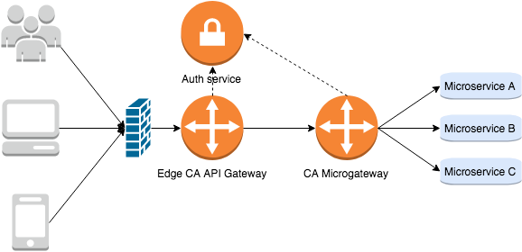

# CA Microgateway

* [What is CA Microgateway](#intro)
  * [Benefits](#benefits)
  * [Related microservices patterns](#patterns)
  * [Extending CA Microgateway](#extending)
  * [Changelog](./CHANGELOG.md)
* [Get started](#get-started)
  * [Prerequisites](#prerequisites)
  * [Deploy CA Microgateway](#deploy)
  * [Expose a microservice API](#api)
* [Next steps](#next-steps)
  * [Try more complex scenarios](#get-further)
  * [End-to-End Demos](#end-to-end)
    *  [Security model for microservices using the CA Microgateway](get-started/get-further/demo-with-live-api-creator)
  * [Samples](#samples)
  * [Documentation](#documentation)

## What is CA Microgateway <a name="intro"></a>
CA Microgateway provides secure service mesh for microservices with rich functionalities of the [CA API Gateway family](https://www.ca.com/us/products/api-management.html) including SSL/TLS, OAuth, service discovery packed in a docker container. You can also easily extend the capabilities of CA Microgateway by building your own policy using the policy building capability available to CA API Gateways.

More features, including the Policy Manager needed to extend CA Microgateway, are available in the [free trial version](https://www.ca.com/us/trials/ca-microgateway.html).

<p align="center">

</p>

### Benefits <a name="benefits"></a>
* Secure microservices without writing the same code in every service
* Integrate with microservices pattern and infrastructure. e.g. Consul service registry
* Optimize internal and external client APIs and reduce API chattiness
* Optimize network traffic by providing caching, circuit breaking ...etc

### Related microservices patterns <a name="patterns"></a>
* API gateway/Backend for Frontend: http://microservices.io/patterns/apigateway.html
* Access token: http://microservices.io/patterns/security/access-token.html

### Extending CA Microgateway <a name="extending"></a>
* After you try out the basic functionality in CA Microgateway, try [some more complex scenarios](#get-further), including [extending CA Microgateway](get-started/get-further/extend-microgateway-with-new-templates.md).
* To download the Policy Manager that is needed to extend CA Microgateway, please get it from [here](https://www.ca.com/us/trials/ca-microgateway.html).

## Get started <a name="get-started"></a>

Supported platforms:
- Linux
- MacOS

### Prerequisites <a name="prerequisites"></a>
- A docker host

  You can use Docker on your laptop or in the Cloud ([get Docker here](https://www.docker.com/get-docker))

  Docker-machine (https://docs.docker.com/machine/drivers) can be used as a quick way to deploy
  a remote Docker host.

  Run the following command to validate that you can reach your Docker host.
  ```
  docker info
  ```

- The cloned, or downloaded, content from this GitHub repository

- Accepted licensing terms (required to start the Microgateway):

  By passing the value "true" to the environment variable `ACCEPT_LICENSE` in
  the file `get-started/docker-compose/config/license-agreement.env`, you are expressing
  your acceptance of the [CA Trial and Demonstration Agreement](LICENSE.md).

  The initial Product Availability Period for your trial of CA Microgateway
  shall be sixty (60) days from the date of your initial deployment. You are
  permitted only one (1) trial of CA Microgateway per Company, and you may not
  redeploy a new trial of CA Microgateway after the end of the initial Product
  Availability Period.

### Deploy CA Microgateway <a name="deploy"></a>

The following tasks will typically be done by a Gateway sysadmin.

- Start CA Microgateway:

  ```
  cd get-started/docker-compose

  docker-compose --project-name microgateway \
                 --file docker-compose.yml \
                 --file docker-compose.db.consul.yml \
                 --file docker-compose.lb.dockercloud.yml \
                 up -d --build
  ```

- Verify that CA Microgateway container is up and running:

  ```
  docker ps --format "table {{.Names}}\t{{.Status}}"
  ```
  Should return:
  ```
  NAMES                STATUS
  microgateway_lb_1    Up About a minute
  microgateway_ssg_1   Up About a minute (healthy)
  microgateway_consul_1    Up About a minute
  ```
 Wait for "healthy" status (~2 minutes); you can repeat the command to refresh status.

- Once CA Microgateway is up and running, you can list the APIs that have been published to it:

  ```
  curl --insecure --user "admin:password" https://localhost/quickstart/1.0/services
  ```
  If the Microgateway has just been started for the first time, it should return an empty set:
  ```
  []
  ```

Other Docker admin tasks that you can do with the container ...

- Print the logs:

  ```
  docker-compose --project-name microgateway \
                 --file docker-compose.yml \
                 --file docker-compose.db.consul.yml \
                 --file docker-compose.lb.dockercloud.yml \
                 logs --follow
  ```

- Scale up/down the Gateway:

  ```
  docker-compose --project-name microgateway \
                 --file docker-compose.yml \
                 --file docker-compose.db.consul.yml \
                 --file docker-compose.lb.dockercloud.yml \
                 up -d --scale ssg=2
  ```
  The Gateway has no scaling limit because it is based on the [The Twelve-Factor App](https://12factor.net/).

- Stop the Gateway:

  ```
  docker-compose --project-name microgateway \
                 --file docker-compose.yml \
                 --file docker-compose.db.consul.yml \
                 --file docker-compose.lb.dockercloud.yml \
                 down --volumes
  ```

### Expose a microservice API <a name="api"></a>

The following steps will typically be done by a developer, and may be done at the command line (per instructions below), or via your favourite API development environment, such as [Postman](https://www.getpostman.com).

- First, create a file named Gatewayfile with the following content:

  ```
  {
      "Service": {
      "name": "Google Search",
      "gatewayUri": "/demo_google",
      "httpMethods": [ "get" ],
      "policy": [
        {
          "RouteHttp" : {
            "targetUrl": "http://www.google.com/search${request.url.query}",
            "httpMethod" : "Automatic"
          }
        }
      ]
    }
  }
  ```

  Save the file into the same directory from which you will make the next API call.

  The Gatewayfile is a JSON file that describes a "meta-policy" that will be published to the Microgateway. Gatewayfile will create a new service that will be accessible at "/demo_google" and will route requests to http://www.google.com.

- Then, add your API to CA Microgateway:

  **note: if you stopped the Microgateway previously, please [start it up](#deploy) again.**

  ```
  curl --insecure \
       --user "admin:password" \
       --url https://localhost/quickstart/1.0/services \
       --data @Gatewayfile
  ```

  Should return confirmation from CA Microgateway that the Google Search API was successfully published:

  ```
  {
    "success": true,
    "message": "Quickstart service created successfully. There maybe a delay of 10 seconds before the service is available."
  }
  ```

- Now, verify that your API is exposed (by listing all published APIs):

  ```
  curl --insecure --user "admin:password" https://localhost/quickstart/1.0/services
  ```

  Should return a list containing the new Google Search service:

  ```
  [
    {
        "ServiceName": "Google Search",
        "ServiceUri": "/demo_google",
        "ServiceId": "8d06f72fcf8447ad99ca4833714e0497",
        "ServiceTimeStamp": "1509564356239"
    }
  ]
  ```

- Finally, try using your exposed API:

  ```
  curl --insecure \
       --header "User-Agent: Mozilla/5.0" \
       'https://localhost/demo_google?q=CA'
  ```

  This API call should return HTML content from the proxied website:

  ```
  <!doctype html><html itemscope="" itemtype="http://schema.org/SearchResultsPage" lang="en"><head>
  <meta content="text/html; charset=UTF-8" http-equiv="Content-Type">
  <meta content="/images/branding/googleg/1x/googleg_standard_color_128dp.png" itemprop="image">
  <link href="/images/branding/product/ico/googleg_lodp.ico" rel="shortcut icon">
  ...
  ```
  Alternatively, you can call the API directly from the browser: https://localhost/demo_google?q=CA.

## Next steps <a name="next-steps"></a>

### For more complex scenarios, try these other tutorials  <a name="get-further"></a>

- [Secure a microservice API with Basic Authentication](get-started/get-further/api-with-basic-auth.md)
- [Secure a microservice API with OAuth](get-started/get-further/api-with-oauth.md)
- [Build a CA Microgateway image with preloaded APIs](get-started/get-further/build-microgateway-with-custom-templates-and-services.md)
- [Register the Google Root TLS certificate](get-started/get-further/register-google-tls-certificate.md)
- [Orchestrate API with RouteOrchestrator](get-started/get-further/api-with-route-orchestrator.md)
- [Extend Microgateway with new templates](get-started/get-further/extend-microgateway-with-new-templates.md)
- [Secure AWS Resources with Microgateway](get-started/get-further/aws/AWS_Integration_Sample_use_cases.md)
- Operations:
  - Install, configuration, upgrade and scale
    - [Docker](get-started/get-further/operations/platforms/docker.md)
    - [OpenShift](get-started/get-further/operations/platforms/openshift.md)
    - [Kubernetes](get-started/get-further/operations/platforms/kubernetes.md)
  - [Logging and auditing](get-started/get-further/operations/system/logging-auditing.md)
  - [Performance tuning](get-started/get-further/operations/system/performance.md)

### End-to-End Demos <a name="end-to-end"></a>
-  [Security model for microservices using the CA Microgateway](get-started/get-further/demo-with-live-api-creator)

### Samples <a name="samples"></a>
- [Microgateway APIs](samples/APIs)
- Alternative plaforms:
  - [OpenShift](samples/platforms/openshift)
  - [Kubernetes](samples/platforms/kubernetes)

### Documentation  <a name="documentation"></a>

- Quick Start Template Documentation - https://localhost/quickstart/1.0/doc on your local Microgateway
- [Reference documentation](https://docops.ca.com/microgateway)
- [Troubleshoot](TROUBLESHOOT.md)
