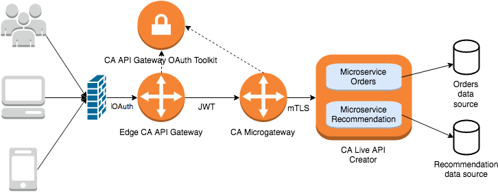

# Sample end-to-end security and integration infrastructure for microservices using Microgateway

* [Architecture](#architecture)
    * [Backend microservice data source](#datasource)
    * [Backend microservices](#microservices)
    * [Authentication and authorization service](#auth)
    * [Microgateway](#microgateway)
* [Prerequisites](#prerequisites)
* [Operate](#operate)
  * [License](#license)
  * [Start](#ops-start)
  * [Update](#ops-update)
  * [Destroy](#ops-destroy)
  * [Debug mode](#ops-debug)
* [Expose APIs](#expose-apis)
  * [Expose and secure microservices](#expose-microservices)
  * [Orchestrate](#orchestrate)
* [Consume](#consume)

## Architecture <a name="architecture"></a>

<p align="center">

</p>

### Backend microservice data source <a name="datasource"></a>

One database service is used per microservice. In our demo, the microservice
`order` uses the database service `orders-db` and the microservice `recommendation`
used the database service `recommendation-db`

### Backend microservices <a name="microservices"></a>

Sample microservices are created and operated by CA API Live Creator. In real life, it can be any microservices. It is configured with Mutual TLS Authentication which to accept connection from Microgateway nodes only.

Admin service: `lac-admin`

Microservices service: `lac-node`

### Authentication and authorization service <a name="auth"></a>

Operated by CA API Gateway OAuth Toolkit (CA OTK) to manage
OAuth client authentication and authorization. Additionally,
the plugin `PolicySDK` serves signed certificate to each Microgateway node based on the Microgateway OAuth client ID.

### Microgateway <a name="microgateway"></a>
Exposes and protect microservices APIs.

## Prerequisites <a name="prerequisites"></a>

- A docker host

  You can use Docker on your laptop or in the Cloud. Docker-machine
  (https://docs.docker.com/machine/drivers/) can be used as a quick way to deploy
  a remote Docker host.

  Run the following command to validate that you can reach your Docker host.
  ```
  docker info
  ```

- 8GB of memory allocated to the Docker host

  See https://docs.docker.com/docker-for-mac/#advanced for guidance.

- Commands:
  - bash (for Windows users, see Git Bash https://git-for-windows.github.io/)
  - docker-compose
  - docker
  - lacadmin (https://github.com/EspressoLogicCafe/CALiveAPICreatorAdminCLI)
  - curl (or another HTTP client)

## Operate <a name="operate"></a>
### License <a name="license"></a>
#### Live API Creator

Accept the [EULA](api-live-creator/etc/license/CA_Technologies_LiveAPI_License.json)
by passing the value "ENU" to the environment variable `ca_accept_license` in
the Live API Creator [eula.env](api-live-creator/etc/eula.env) file.

#### OTK

Accept license by passing the value "true" to the environment variable `ACCEPT_LICENSE` in
the OTK [license.env](../../external/otk/config/license.env) file.

#### Microgateway

By passing the value "true" to the environment variable `ACCEPT_LICENSE` in
the file [license.env](../../docker-compose/config/license.env), you are expressing
your acceptance of the [Microservices Gateway Pre-Release Agreement](../../../LICENSE.md).

### Start <a name="ops-start"></a>
```
cd get-started/get-further/demo-with-live-api-creator
./demo.sh start
```

#### Wait for the containers to be healthy
```
docker ps --format "table {{.Names}}\t{{.Status}}"
```
should return:
```
NAMES                      STATUS
demo_lb_1                  Up 21 minutes
demo_ssg_1                 Up 21 minutes (healthy)
demo_otk_1                 Up 23 minutes (healthy)
demo_otk_mysqldb_1         Up 23 minutes
demo_lac-admin_1           Up 23 minutes
demo_lac-node_1            Up 23 minutes
demo_lac_mysql_1           Up 23 minutes
demo_recommendation-db_1   Up 23 minutes
demo_orders-db_1           Up 23 minutes
```

### Update <a name="ops-update"></a>
Simply re-run the command from the "Start" section. Docker will only relaunch
modified configuration.

### Destroy <a name="ops-destroy"></a>
```
cd get-started/get-further/demo-with-live-api-creator
./demo.sh stop
```

### Debug mode <a name="ops-debug"></a>
```
export DEMO_DEBUG=1
```

then run `demo.sh`.

## Expose microservice APIs <a name="expose-apis"></a>

### Expose and secure <a name="expose-microservices"></a>

*This step will typically be done by a microservice developer or a continuous
integration and continuous delivery system like Jenkins*

We will expose and secure with the Microgateway the two microservices "Orders"
and "Recommendation" created in Live API Creator.

Each API is defined in JSON in a file that we named "Gatewayfile".

- Orders:

```
curl --insecure \
     --user "admin:password" \
     --url https://localhost/quickstart/1.0/services \
     --data @microservices/orders/Gatewayfile
```

- Recommendation:

```
curl --insecure \
     --user "admin:password" \
     --url https://localhost/quickstart/1.0/services \
     --data @microservices/recommendation/Gatewayfile
```

### Orchestrate <a name="orchestrate"></a>

*This step will typically be done by an API owner*

We will create an API that orchestrates the two microservice APIs that we
previously exposed in the Microgateway. This API will be exposed on the edge
Gateway.

```
curl --insecure \
     --user "admin:password" \
     --url https://localhost:9443/quickstart/1.0/services \
     --data @apis-orchestration/recommendator.json
```

## Consume <a name="consume"></a>

*This step will typically be done by an end user*

The public API is consumed from the ingress gateway securing and orchestrating
backend microservice APIs.

- Get an OAuth token:

The user `cgriffin` was preconfigured with an OAuth client having the OAuth scopes
profile, email, phone, address, orders, recommendation. The exposed microservice
APIs on the Microgateway requires the scope "orders" for the first microservice
and "recommendation" for the second one.

```
curl --insecure \
     --data "client_id=oauthclientkey" \
     --data "client_secret=oauthclientsecret" \
     --data "scope=orders%20recommendation" \
     --data "grant_type=password" \
     --data "username=cgriffin" \
     --data 'password=StRonG5^)' \
    'https://localhost:8443/auth/oauth/v2/token'
```
which should return:
```
{
  "access_token":"b5445054-d9b6-4c42-9f0a-be5685dc67fa",
  "token_type":"Bearer",
  "expires_in":3600,
  "refresh_token":"7a02ebd9-9b1a-4458-b5f4-843a7f2b1921",
  "scope":"orders recommendation"
}
```

Take note of the `access_token` to call the public API.

- Call the public API:

```
curl --insecure \
     --header "User-Agent: Mozilla/5.0" \
     --header "Authorization: Bearer <access_token>" \
     'https://localhost:9443/recommendator?customer=129'
```
with:
  - `<access_token>`: the value of the token received in the previous step.
