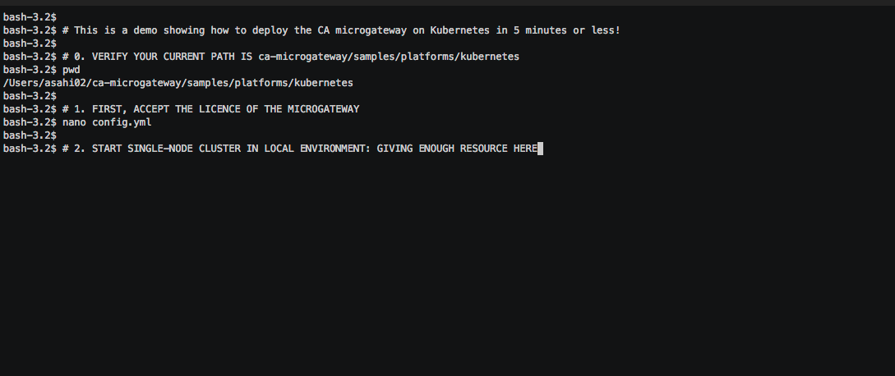

## CA Microgateway on Kubernetes: configure, install, upgrade, scale and more

Watch the demo!
[](https://asciinema.org/a/UTvWrf4YEdzITeclhV4yAqvKP)

* [Prerequisites](#prerequisites)
* [Deployment diagram](#diagram)
* [Operation commands](#ops-commands)
  * [Configure](#configure)
  * [Install](#install)
  * [Update strategies](#upgrade)
  * [Scale up/down](#scale)
  * [Autoscaling](#autoscaling)
  * [Logs](#logs)
  * [Health Check](#health-check)
  * [Uninstall](#uninstall)

### Prerequisites <a name="prerequisites"></a>
 - A machine running the Kubernetes cluster with a minimum 4GB of memory:
    - Minikube on a laptop (https://github.com/kubernetes/minikube) ([quickstart](./kubernetes-minikube.md))
    - Any other Kubernetes (https://kubernetes.io/docs/setup/pick-right-solution)
- Kubectl (https://kubernetes.io/docs/tasks/tools/install-kubectl) to operate the
CA Microgateway on Kubernetes
- Your Kubernetes credentials set in the file `~/.kube/config`

### Deployment diagram <a name="diagram"></a>

[microgateway-on-kubernetes]: img/kubernetes_draw.io.png "CA Microgateway on Kubernetes"
![alt text][microgateway-on-kubernetes]

The CA Microgateway cluster running on Kubernetes is at least composed of:
- a Kubernetes route exposing the CA Microgateway service to users
- a Kubernetes service load balancing requests to the CA Microgateway containers
- Kubernetes pods hosting respectively a CA Microgateway container

CA Microgateway containers synchronize exposed API definitions with a database or a
key/value store.

*Note: The database/KV store and microservices can optionally run in the same
Kubernetes*

## Operation commands <a name="ops-commands"></a>

The Kubernetes YAML files deploying CA Microgateway are located in the folder [/samples/platforms/kubernetes/](../../../../samples/platforms/kubernetes/).

### Configure <a name="configure"></a>

*Note: please refer to the main documentation for the list of required and optional
environment variables: https://docops.ca.com/ca-microgateway/1-0/EN.*

Open [config.yml](../../../../samples/platforms/kubernetes/config.yml) and set `ACCEPT_LICENSE` value to `true`.

*By passing the value "true" to the key `ACCEPT_LICENSE`
in the file config.yml, you are expressing
your acceptance of the CA Trial and Demonstration Agreement. The
initial Product Availability Period for your trial of CA Microgateway shall be
sixty (60) days from the date of your initial deployment. You are permitted only
one (1) trial of CA Microgateway per Company, and you may not redeploy a new
trial of CA Microgateway after the end of the initial Product Availability Period.*

For Postgres storage, edit `db-postgresql.yml`.
```
QUICKSTART_REPOSITORY_DB_HOST: "10.137.227.146"
```

The IP should be your public laptop IP if the Postgres container is running on your laptop.


### Install <a name="install"></a>

#### Start deployments of pods and services defined in yaml

Three deployment modes of the CA Microgateway are listed here.

1. CA Microgateway with Consul as a service datastore,
    ```
    kubectl apply --filename microgateway.yml --filename config.yml --filename db-consul.yml
    ```
2. CA Microgateway with PostgreSQL as a service datastore, or
    - Deploy PostgreSQL:

      From the folder /get-started/docker-compose folder, build and run Postgres:

      ```
       docker image build --file Dockerfile.postgresql . -t postgres:micro
       docker run -d -p 5432:5432 --env POSTGRES_DB=qstr  --env POSTGRES_USER=causer --env POSTGRES_PASSWORD=capassword postgres:micro
      ```

    - Start CA Microgateway:

      From the folder `/samples/platforms/kubernetes/`, update the variable `QUICKSTART_REPOSITORY_DB_HOST`
      in the file `db-postgresql.yml` to the IP address or hostname of your PostgreSQL database. Then, start CA Microgateway:

      ```
      kubectl apply --filename config.yml --filename db-postgresql.yml --filename microgateway.yml
      ```

3. Immutable CA Microgateway
    ```
    kubectl apply --filename microgateway.yml --filename config.yml
    ```

Wait for the Gateway to be up by looking at deployment status of "deploy/microgateway-dc"
to have AVAILABLE=1:
```
kubectl get all
```

#### Add the public Kubernetes cluster IP and hostname mapping to the host file
```
echo "192.168.99.100 microgateway.mycompany.com" | sudo tee -a /etc/hosts
```

#### How to enable Ingress to proxy a traffic from external network to internal nodes
The microgateway container inside pods in a cluster is not accessible from outside the internal network.
To access the CA Microgateway, Kubernetes gives various options like hostNetwork, hostPort, NodePort, LoadBalancer and Ingress to expose services to external network. In this documentation, NodePort is used to access the CA Microgateway.

Verify that `ingress` and `kube-dns` are both `enabled`:
```
minikube addons list
```

If `ingress` is disabled, make sure to enable it:
```
minikube addons enable ingress
```

CA Microgateway is reachable on https://microgateway.mycompany.com/.

## Update <a name="upgrade"></a>

Write the new configuration in the configuration file `config.yml`, then re-run
the `kubectl apply` command. Apply command will redeploy only the updated services.

## Scale up/down <a name="scale"></a>

- Using the Kubernetes YAML file (e.g. `microgateway.yml`)

  The `replicas` key of the Deployment configuration block sets the number of
  CA Microgateway pods to deploy:

  ```

    apiVersion: extensions/v1beta1
    kind: Deployment
    metadata:
        name: microgateway-dc
        labels:
            app: microgateway
    spec:
    replicas: 1
  ```

  Then push the new configuration by running something like:
  ```
  kubectl apply --filename microgateway.yml --filename config.yml --filename db-consul.yml
  ```

- Using the Kuberetes command line "kubectl":

  In the previous example, the deployment configuration is named `microgateway-dc`.
  Instead of pushing a new deployment configuration, the `kubectl autoscale` command can
  be used:

  ```
  kubectl scale --replicas=3 --filename microgateway.yml
  ```

## Autoscaling <a name="autoscaling"></a>

  Autoscaling is done by adding a Kubernetes element `HorizontalPodAutoscaler` to
  the Kubernetes YML file (e.g. `microgateway.yml`).

  The following example scales up the Kubernetes Deployment Configuration
  `microgateway-dc` if the CPU reaches 80%.

  ```
  apiVersion: autoscaling/v1
  kind: HorizontalPodAutoscaler
  metadata:
    name: microgateway-hpa
  spec:
    scaleTargetRef:
      kind: Deployment
      name: microgateway-dc
    minReplicas: 1
    maxReplicas: 10
    targetCPUUtilizationPercentage: 80
  ```

  Then push the new configuration:
  ```
  kubectl apply --filename microgateway.yml
  ```

  Details about autoscaling can be found at
  https://kubernetes.io/docs/tasks/run-application/horizontal-pod-autoscale/

## Logs <a name="logs"></a>

- Print logs:

```
kubectl logs -f deployment/microgateway-dc
```
Where `microgateway-dc` is the name of our Deployment Configuration defined
in `microgateway.yml`.

## Health check <a name="health-check"></a>

```
apiVersion: extensions/v1beta1
kind: Deployment
metadata:
  name: microgateway-dc
  labels:
    app: microgateway
spec:
containers:
- name: microgateway
  image: [...]
  env:
    [...]

  ports:
    [...]

  readinessProbe:
    exec:
      command:
      - /opt/docker/rc.d/diagnostic/health_check.sh
    initialDelaySeconds: 480
    periodSeconds: 15
    timeoutSeconds: 1

  livenessProbe:
    exec:
      command:
      - /opt/docker/rc.d/diagnostic/health_check.sh
    initialDelaySeconds: 90
    periodSeconds: 15
    timeoutSeconds: 1
```
Where:
  - `microgateway-dc` is the name of our Deployment Configuration defined in `microgateway.yml`
  - `readinessProbe` determines if a container is ready to service requests
  - `livenessProbe` determines if a container is running properly to serve requests
  - `/opt/docker/rc.d/diagnostic/health_check.sh` is the Microgateway health check script running inside the container

Using Kubernetes command line(kubectl)

```
kubectl get deployments
```

Will return the list of Kubernetes deployments with their associated status

```
NAME                DESIRED   CURRENT   UP-TO-DATE   AVAILABLE   AGE
consul-dc           1         1         1            1           21m
microgateway-dc     1         1         1            1           20m
```

Details about Kubernetes Application Health Check can be found at
https://kubernetes.io/docs/tasks/configure-pod-container/configure-liveness-readiness-probes/

## Uninstall <a name="uninstall"></a>

Run `kubectl delete` with the same --filename options as in the install section.

For example:
```
kubectl delete --filename microgateway.yml --filename config.yml --filename db-consul.yml
```
